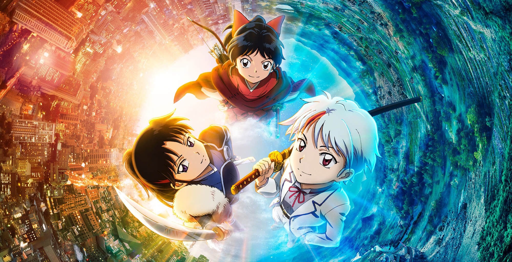

# Manga
***
{: style="width:900px"}
***      
## Intro
***
El manga (漫画, en kanji; まんが, en hirigana; マンガ, en katakana) és el còmic d'origen japonès, desenvolupat al final del segle xix. No obstant això, la seva forma moderna data poc després de la Primera Guerra Mundial. El manga ha tingut un llarg i complex precursor en la història de l'art japonès.

El manga és un còmic apte per a totes les edats. Inclou una àmplia gamma de temes: acció-aventura, romanç, esports, drama històric, comèdia, ciència-ficció-fantasia, misteri, terror, sexualitat, el món de les empreses i el comerç entre d'altres. Des de la dècada de 1950, el manga s'ha tornat una part important de la indústria de l'editorial japonesa, que ha representat un mercat de 481 mil milions de iens al Japó el 2006 (aproximadament 2,66 mil milions d'euros a l'època). A escala mundial, el manga cada vegada ha anat obtenint més popularitat. Els mangues són normalment impresos sense color, tot i que alguns es fan a color, ja siguin només algunes pàgines, capítols especials o tot ell. Normalment els mangues són publicats per primera vegada en revistes d'antologies de tiratge setmanal o mensual (com la **[Shonen Jump](https://ca.wikipedia.org/wiki/Sh%C5%ABkan_Sh%C5%8Dnen_Jump)** o la **[Big Comic](https://ca.wikipedia.org/wiki/Big_Comic)**). Aquestes revistes d'antologies contenen centenars de pàgines i desenes d'històries individuals escrites per diversos autors. Són impreses en paper de diari i són d'un sol ús. Si la sèrie té èxit, els capítols són recollits en una sèrie de volums anomenats **[tankōbons](https://ca.wikipedia.org/wiki/Tank%C5%8Dbon)** (Normalment de 9 a 11 capítols). Un dibuixant de manga (**[mangaka](https://ca.wikipedia.org/wiki/Mangaka)**) normalment treballa amb uns pocs assistents en un petit estudi i s'associa amb un redactor creatiu d'una companyia de publicitat comercial. Si una sèrie manga és prou popular, pot ser portada a l'animació en un format anomenat anime, encara que a vegades és a l'inrevés i és el manga qui surt de pel·lícules d'animació.

"Manga" com un terme que s'utilitza fora del Japó es refereix específicament als còmics publicats originalment al Japó. Tanmateix, hi ha el manga i els còmics influenciats pel manga, entre els quals es destaquen especialment a Taiwan («manhua»), Corea del Sud («manhwa»), i a la República Popular de la Xina; en particular de Hong Kong («manhua»). A França, «la nouvelle manga» s'ha desenvolupat com una forma de bande dessinée extretes en els estils influenciats pel manga japonès. Als Estats Units, la gent es refereix al manga produït al seu país com a còmics amerimanga.

És un dels instruments del poder tou japonès.