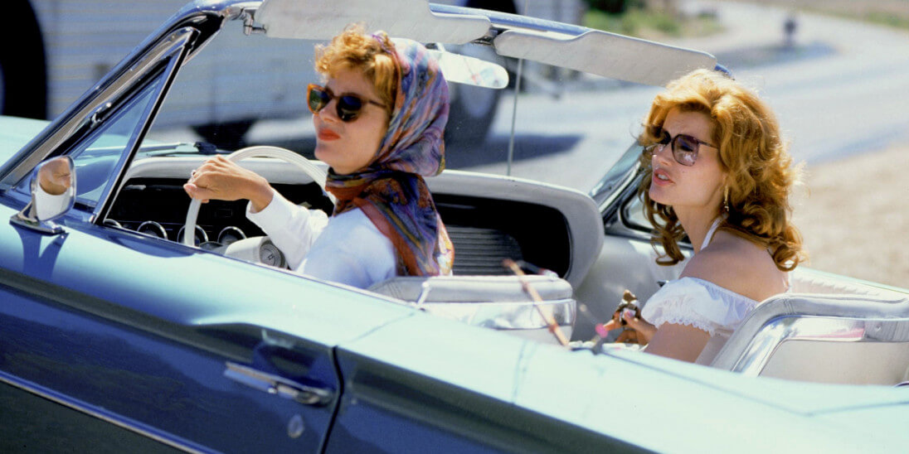

# Road Movie
***
{: style="width:900px"}
***
## Intro
***
El terme **road movie** (de l'anglès 'pel·lícula de carretera') designa un gènere cinematogràfic en el qual l lloc de la intriga és la carretera mateixa i no els llocs que travessa.

Es pot veure la carretera com una metàfora del temps que desfila, de la vida amb les seves trobades i les seves separacions; accelerant, un s'apropa a la trobada següent, com si s'accelerés el temps. Les road movies representen sovint una cerca iniciàtica dels personatges, que maduren al fil de les seves trobades i de les seves experiències i es fan adults, el viatge és llavors un ritu de passatge. Es pot veure també com una metàfora del cinema mateix, tenint les línies dibuixades a l'asfalt una estranya semblança amb les perforacions de la pel·lícula. Finalment, la carretera simbolitza tant la llibertat de moviment, i per tant les llibertats individuals, com l'exili, el sofriment, el vagareig.

Entre els temes habituals de les road movies es poden citar:

- La fugida
- La investigació sobre una persona desapareguda o perduda de vista
- La carrera (per exemple: **[El món és boig, boig, boig](https://ca.wikipedia.org/wiki/El_m%C3%B3n_%C3%A9s_boig,_boig,_boig)**, de Stanley Kramer, 1963)
- El viatge d'esbarjo
- El vagareig
- L'evolució de la infantesa a l'adolescència