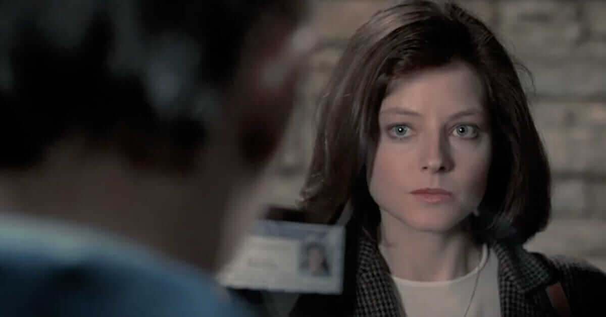

# Thriller
***
{: style="width:900px"}
***
## Intro
***
El thriller (anglicisme, del verb to thrill, 'estremir-se') és un gènere artístic present en la literatura, el cinema i la televisió, i que se subdivideix en nombrosos subgèneres. La característica comuna de les obres que pertanyen a aquest gènere és d'intentar provocar en l'espectador o el lector una tensió o angoixa psicològica amb la idea d'allò que podria arribar als personatges.

Aquest efecte s'aconsegueix sovint amb certs estereotips, com la utilització de seqüències filmades al ralentí, una acció constant, un heroi dotat de múltiples recursos... S'utilitza abundantment el suspens (en el cinema, un "thriller" pot ser considerat com a sinònim de "pel·lícula de suspens"): sovint, les intrigues secundàries contraresten el desenvolupament de la principal, es fan seguir pistes falses i hi ha nombrosos capgiraments inesperats (en particular, en les últimes escenes). El cineasta **[Alfred Hitchcock](https://ca.wikipedia.org/wiki/Alfred_Hitchcock)** és sovint considerat com "el mestre" del gènere.

Aquest gènere és proper al del cinema d'espionatge i el cinema policíac. Així, una pel·lícula com Seven, de David Fincher, es pot classificar com a "thriller", però també com a "pel·lícula policíaca", ja que la intriga consisteix en una investigació policíaca.

## hola

